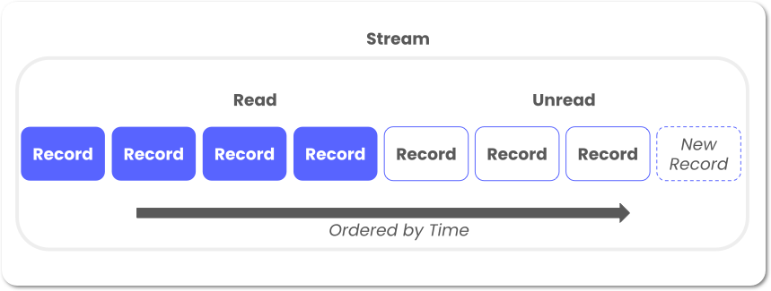

This is a [Singer](https://singer.io) target that reads JSON-formatted data from a [StreamDuo](https://streamduo.com) stream, and outputs the data
following the [Singer spec](https://github.com/singer-io/getting-started/blob/master/SPEC.md).


StreamDuo  is a platform for private data streaming, giving you the ability to privately share data asynchronously with external partners, managing authentication on the StreamDuo console.

## What is a StreamDuo Stream?

A Stream is a private channel for sharing event streams with your external partners. Parties can asynchronously read/write records through a REST endpoint, using simple APIs, Singer Taps/Targets, or SDKs.

Records are stored in a time-order series, and the "read-status" of each record is maintained within StreamDuo:



[More Info](https://docs.streamduo.com/how) on how StreamDuo works.

## How the Tap Works

Because read status is maintained within StreamDuo, there is no need to manage state within this tap. The tap continuously polls the `get unread records` endpoint from StreamDuo. 

If your process dies, there is no need to adjust state, just start it again, and it will pickup where it left off.

## Idempotency

Events are not idempotent in StreamDuo. If your partner sent the exact same payload twice, it will be stored as two records in the stream. Those two records will have different timestamps, and different record IDs, but there is no deduplicating or overwriting of records with the same payloads.


# Using the Tap

## Setup A Stream

Setup a StreamDuo stream with your partner.

[See the Quick Start Videos](https://docs.streamduo.com/quick/#video-quick-start)

## Install Tap

Requires Python 3

`pip install tap-streamduo`

## Set your Configuration Variables

There are a 3 required config variables:

```buildoutcfg
{
  "streamId": "60c49e86-zzzz-xxxx-87a1-f51ccee4ec0c",
  "clientId": "xxxx",
  "clientSecret": "xxxx"
}
```

These can be obtained from the StreamDuo console.

### Reading Records

The `record` object will be sent to StreamDuo, mapped to the `dataPayload` field in StreamDuo.

A StreamDuo record consists of a core payload in the `dataPayload` field, and some metadata about the record:

```buildoutcfg
{
  "recordId": "506d0a86-8f84-417a-a989-a995e6e40e23",
  "streamId": "60c49e86-9db3-414a-87a1-f51ccee4ec0c",
  "recordTimeStampISO": "2022-02-01T15:16:23.716848-05:00[America/New_York]",
  "readStatus": "false",
  "dataPayload": {
    "carData": {
      "Make": "Toyota",
      "Price": "$6,250.00",
      "Odometer (KM)": "60000",
      "Colour": "White",
      "Doors": "4"
    }
  }
}
```

This would be read by the tap, and output as a SINGER records like this (made multi-line for ease of view, but must be single line in practice, as per Singer standards):
```buildoutcfg
{
  "type": "RECORD",
  "stream": "records",
  "record": {
    "recordId": "506d0a86-8f84-417a-a989-a995e6e40e23",
    "streamId": "60c49e86-9db3-414a-87a1-f51ccee4ec0c",
    "recordTimeStampISO": "2022-02-01T15:16:23.716848-05:00[America/New_York]",
    "readStatus": "false",
    "dataPayload": {
      "carData": {
        "Make": "Toyota",
        "Price": "$6,250.00",
        "Odometer (KM)": "60000",
        "Colour": "White",
        "Doors": "4"
      }
    }
  }
}
```

# Tap Development

```
git clone https://github.com/streamduo-inc/tap-streamduo.git
cd target-streamduo
python3 -m venv ~/.virtualenvs/tap-streamduo
source ~/.virtualenvs/tap-streamduo/bin/activate
pip install -e .
```


### Unit Testing

`python -m unittest`


### Integration Testing
Using a live stream, add a few records to your stream and construct your config file....

`tap-streamduo -c config.json `


These records can be viewed in your console to ensure their accuracy.


---

Copyright &copy; 2022 StreamDuo
